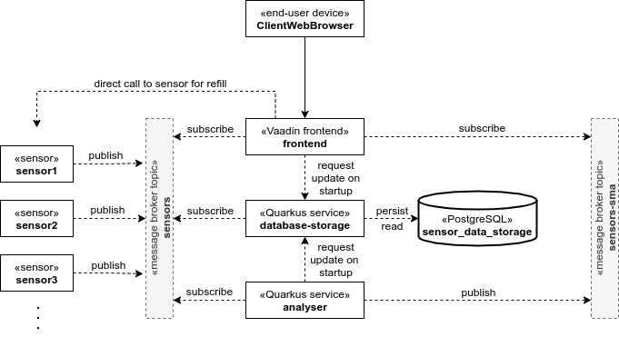

# Sanifill [](https://www.gnu.org/licenses/gpl-3.0)

Sanifill is a system which allows analytics of the usage of liquid in sanitary liquid containers like soap dispensers or 
hand sanitiser containers. Sanifill does so by reading the filling of liquid containers through sensors which are then 
published to a Kafka topic. From this topic, several consumers can read the sensor data and perform their analytics.

The read data of the sensors contains two dimensions: the filling of a container and the time this filling was 
registered. The filling on its own is used to show the current filling. Together with the time, a longer history can be 
observed. The historical behaviour of the system then allows future forecasts. The frontend subscribes to the topic 
with the sensor data directly to display the current filling. Another service uses the sensor data directly and 
calculates a simple moving average of the filling gradient to forecast the depletion.

To enable more sophisticated analytics in future implementations, a service listens to the sensor data and persists them 
in a database.

The idea of Sanifill is to equip huge sanitary facilities (e.g. at highway service stations) with Sanifill. The sensors 
measure the content of soap dispensers and analytics can be performed on them. Planning for and execution of the needed 
maintenance becomes easier and cheaper. The improved maintenance then results in happier customers. As hand sanitiser 
containers became more present in times of COVID, Sanifill can also help to support the health protection.

Sanifill uses sensors which are integrated in the existing environment and therefore, adapt to the user. The system's 
user, a cleaner or someone else responsible for refilling the liquid containers, benefits from the information the 
system provides while the end-user of the sanitary facilities does not directly realise the existence of Sanifill or the 
system's sensors. As these sensors sense their environment, the filling of their monitored liquidity container, the 
system is context-aware and, as opposed to sampling methods, listens to events. This event-driven architecture is 
realised with asynchronous messaging via the message broker Apache Kafka.

## Architecture

The architecture for a local setup is shown in the following image. The information on how to start the system can be 
found in the section [Run](#run).



## Run

* For the system to function, one have to start a message broker and other infrastructure which the system needs 
  (amongst others Kafka and database). This can be achieved by spinning up the Docker containers in 
  [docker-compose.yml](infrastructure/docker-compose.yml) with a simple
  ```shell script
  docker-compose up
  ```
* To simulate some physical sensors which publish their data to Kafka, start any desired number of sensors in the folder 
  [sensor](sensor) with 
  ```shell script
  ./mvnw quarkus:dev \
      -Dquarkus.http.port=<port> \
      -Dsensor.id=<sensor-id>
  ```
* Sophisticated analytics often requires the history of more or all the sensor data. The service 
  [database-storage](database-storage) consumes the Kafka messages to store them in a relational database. Start the 
  service by navigating to its folder and executing the command 
  ```shell script
  ./mvnw quarkus:dev \
      -Dquarkus.http.port=<port>
  ```
* To analyse the sensor data, the service [analyser](analyser) calculates a moving average of the gradients of the 
  sensor data. These averages are then used to get an expected depletion date. At startup, the services attempts to 
  retrieve the current sensor data from the `database-storage` and therefore needs the port of the storage. To let the 
  service consume the channel`sensors` and produce new messages on the channel `sensors-sma`, navigate to the service's 
  folder and execute the command
  ```shell script
  ./mvnw quarkus:dev \
      -Dquarkus.http.port=<port> \
      -Dsanifill.storage-service.port=<storage-port> \
      -Danalyser.sma-values=<number-of-values-for-sma>
  ```
* You can then use the Vaadin frontend to consume the sensor data from Kafka and display analytics performed on the 
  data. On startup, the frontend attempts to retrieve the latest sensor data from the storage service. It therefore has 
  to know the storage service's port via the property `sanifill.storage-service`. Just start the 
  [Sanifill frontend](frontend) by navigating to its folder and executing the command
  ```shell script
  mvn spring-boot:run -Pproduction \
      -Dsanifill.storage-service.port=<storage-port>
  ```
  Open `http://localhost:8080/` to see the frontend programme.

## Used Technology

* _Quarkus_ to build sensor simulations and backend services
* _Kafka_ (with _Zookeeper_) as message broker between sensors and other components
* _PostgreSQL_ as relational database to persist sensors' data and retrieve them for analytics
* _Spring Boot_ and _Vaadin_ to build frontend which consumes other services via Kafka and REST API
* _Docker_ to run required infrastructure and simplify running of built applications

## Copyright and License

Copyright © 2021, [Felix Seifert](https://www.felix-seifert.com/)

This programme is free software. It is licensed under the GNU GPL version 3 or later. That means you are free to use 
this programme for any purpose; free to study and modify this programme to suit your needs; and free to share this 
programme or your modifications with anyone. If you share this programme or your modifications, you must grant the 
recipients the same freedoms. To be more specific: You must share the source code under the same license.
For details see [https://www.gnu.org/licenses/gpl-3.0.html](https://www.gnu.org/licenses/gpl-3.0.html)